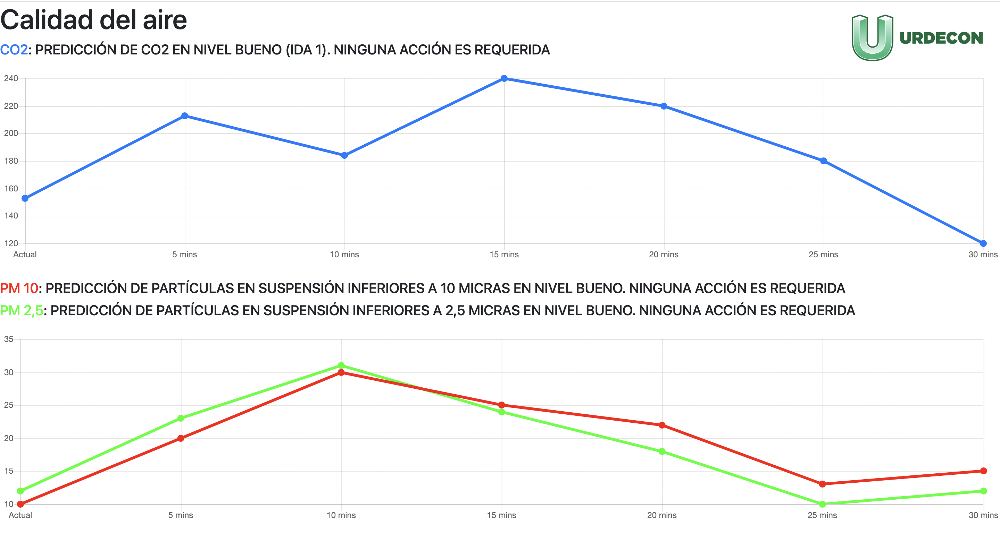

# Proyecto calidad del aire

Proyecto de desarrollo de una pagina web para la preddiocion del C02 y particilas. Mas informacion en el informe: **https://docs.google.com/document/d/1vXl4VodWB90kVFxGDpiBwofcTIe0YqY5n6q-zRTy6Tk**

### Esquema Resumen

```
__CTCON CLIENT__       ___________CENTIC APP_____________       ______HOPU________
|              |      |                                  |     |                  |
| Tablet with  |<-----| frontend <- Internal  <- backend |<----| air quality API  |
| web browser  |      |  script     data.json    script  |     | person count API |                   
|______________|      |__________________________________|     |__________________|
```


### BACKEND SCRIPT

```           
    data.json <----------- backend.sh
 
Initial setup:
  1. Get access token from the HOPU API endpoint
  2. Get if the sensor device is available

Pipeline:              
  1. Read air quality data from HOPU API endpoint
  2. Read person count data from HOPU API endpoint
  3. Run the Machine learning model to forecast the future
  4. Overwrite results on the data.json file

This pipeline is run every 5 mins
(this can be done with an infinite while loop with sleep 5*60)
(or also can be done be setting a crontab job every 5 minutes)
```


### FRONTEND SCRIPT

```
    frontend.sh <-------- frontend.html <-------- data.json

Web server using netcat in a while loop
to display the content of frontend.html

frontend.html is a template which reads the data from data.json

The frontend.html refresh iteself in the browser
every 60 seconds because it has in the <head> section:

  <meta http-equiv="refresh" content="60">
```


